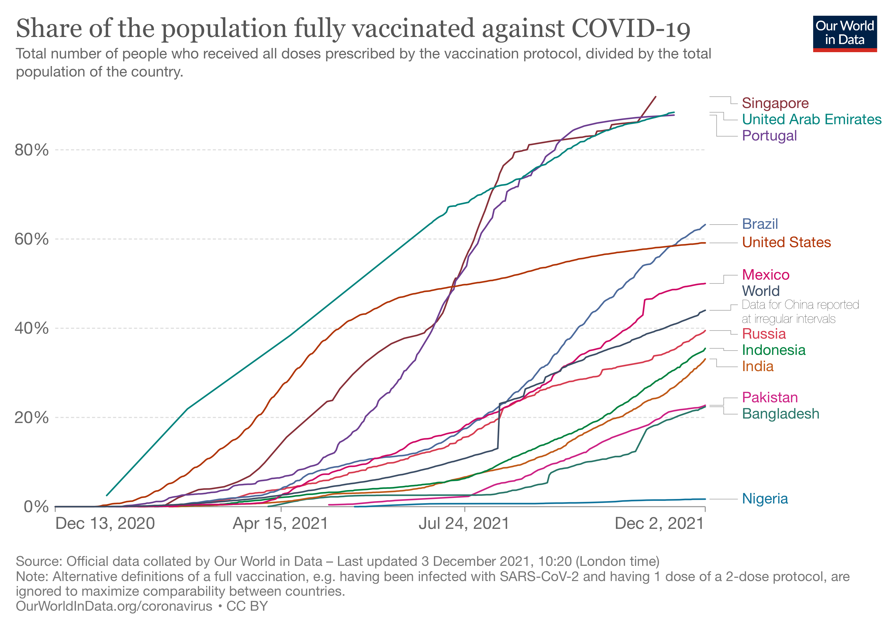
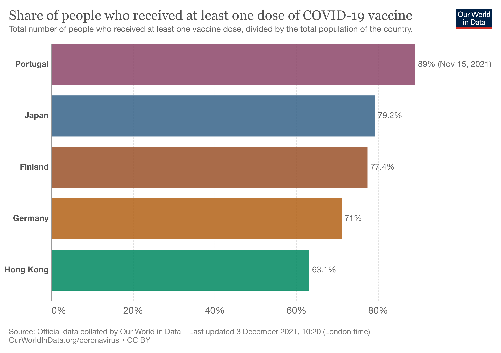
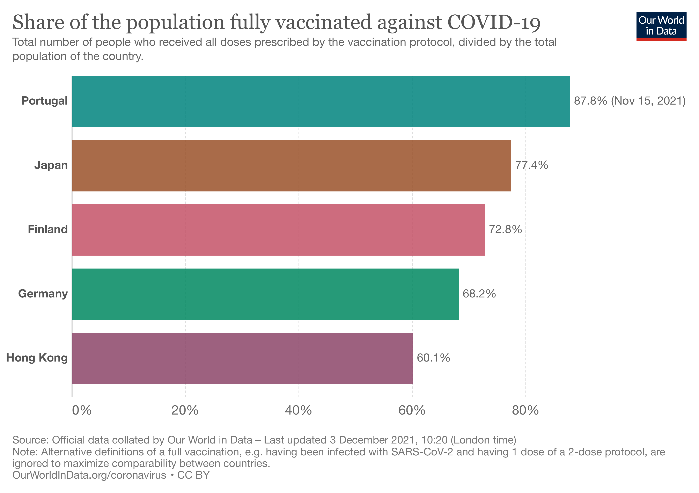
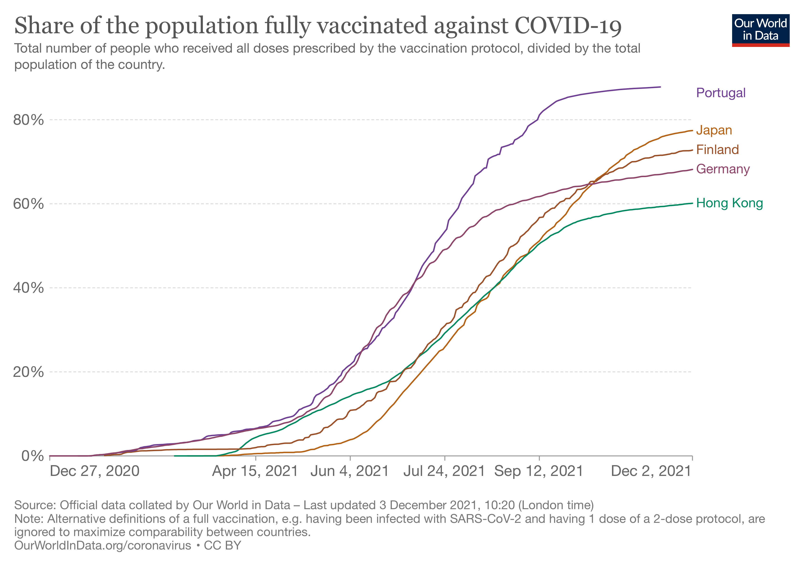

```{r setup, include=FALSE}
# This chunk sets echo = TRUE as default, that is print all code.
# knitr::opts_chunk$set can be used to set other notebook generation options, too.
# include=FALSE inside curly brackets makes this block not be included in the pdf.
# install.packages("remotes")
# remotes::install_github("avehtari/BDA_course_Aalto",
#         subdir = "rpackage", upgrade="never")
# install.packages("aaltobda")
knitr::opts_chunk$set(echo = TRUE)
library(aaltobda)
library(rstan)
library(loo)
# install.packages("LaplacesDemon")
library(LaplacesDemon) # important for the density plots
options(mc.cores = parallel::detectCores())
rstan_options(auto_write = TRUE)
```

# 1. Introduction

It's been almost 2 years since the covid-19 started in December 2019, and it's been 1 year since world vaccination has been started December 2020. Even though most of the countries rushing into vaccination and some countries are picking over 80% rate in vaccination, the pandemic seems unstoppable. One of the popular idea to stop the pandemic is that to achieve a 'herd-immunity threshold, which occurs when a large portion of a community (the herd) becomes immune to a disease, making the spread of disease from person to person unlikely. Immune individuals are unlikely to contribute to disease transmission, disrupting chains of infection, which stops or slows the spread of disease @wiki.
It is known that the herd-immunity threshold is achievable only with high vaccination rates, and many scientists had thought that once people started being immunized en masse, herd immunity would permit society to return to normal. Most estimates had placed the threshold at 60–70% of the population gaining immunity, either through vaccinations or past exposure to the virus @nature.
Down below shows the graph of population fully vaccinated by countries.

```{r}

```

As the high vaccination rate is a big part of ending pandemic by achieving herd-immunity, our group was interested in predicting how much high vaccination rate that countries will achieve in future. As we expect the cumulative vaccination rate graph will follow logit function, we set our model as a logit function. We picked 5 countries,which are Finland, Portugal, Japan, Germany,and Hongkong for our data. The cumulative vaccination graphs in these countries roughly follow the logit function and our main modeling idea is to see find which model the data fits well (seperate model or hierarchical model) and to predict the future vaccination rate.

Down below shows the barplot of population rate who received at least one dose of covid19 vaccine by countries in our interest.

```{r}

```

Down below shows the barplot of population rate of fully vaccinated against covid19 by countries in our interest.

```{r}

```

Down below shows the barplot of fully vaccinated population rate by countries in our interest.

```{r}

```

# 2. Dataset

Datasets down below show cumulative covid vaccinations rate by countries( collected from [linked phrase](https://ourworldindata.org/covid-vaccinations)).Country  column shows the country of this data. X column is originally from the date when the country started vaccination to the recent date of vaccination. We normalized the date column by giving index 0 to number of date and deviding it with the number of date. As the time length of the vaccination differs by country, we uniformly picked the 222 datapoints from the datasets before normalize the X column. Y column shows the covid vaccination rate in the country. With the cumulative covid vaccination number, we devide it by 2 times population because most of the vaccines require 2 doses to be fully vaccinated. Therefore, dimension of all datasets are (222,3).

```{r}
#setwd('/Users/chuhyeongyeong/2021_period1/bayesian_data_analysis/bda_aalto_project')
#setwd("/home/chooh1/notebooks/BDA/project")
finland <- read.csv("data/Finland_output.csv")
germany <- read.csv("data/Germany_output.csv")
hongkong <- read.csv('data/Hong Kong_output.csv')
portugal <- read.csv('data/Portugal_output.csv')
japan <- read.csv('data/Japan_output.csv')
```

```{r}
cat('dimenstion of Finland dataset: ',dim(finland),'\n')
cat('dimenstion of Germany dataset: ',dim(germany),'\n')
cat('dimenstion of HongKong dataset: ',dim(hongkong),'\n')
cat('dimenstion of Portugal dataset: ',dim(portugal),'\n')
cat('dimenstion of Japan dataset: ',dim(japan),'\n')
```


```{r}
total= rbind(finland,germany,hongkong,portugal,japan)
ggplot(data = total, aes(x = X, y = Y, color = Country)) +
    geom_line() +
    ggtitle("Cumulative covid19 vaccination rate") +
    xlab("time") + ylab("vaccination rate")
```

# 3. Mathematical Models and Stan code

## Seperated Model

$$
\begin{aligned}
y_{i j} \mid \mu_i, \sigma &\sim \operatorname{Normal}\left(\mu_i, \sigma\right) \\
\mu_i &\sim \operatorname{logit}(\alpha_i, \beta_i)\\
\sigma &\sim \text{inv}\chi^2(1)\\
\\
\alpha_i &\sim \text{inv}\chi^2(1) \\
\beta_i &\sim N(0.5,1) \\
\end{aligned}
$$

We will first try to build the seperated model in stan

```{r}
seperated_model <- "
functions {
  real[] logit_transform(real[] x, real k, real x0) {
    int N = size(x);
    real xtemp[N];
    for (i in 1:N){
      xtemp[i] = 1 / (1 + exp(-k * (x[i] - x0)));
    }
     return xtemp;
  }
}

data {
    int<lower=1> J;
    int<lower=1> M;
    int<lower=0> N; // number of data points
    real x[M,N]; // observation year
    real y[M,N]; // observation number of drowned
    real xpred[J];  // prediction year
}

parameters {
  real alpha[M];
  real beta[M];
  real<lower = 0> sigma;
}

transformed parameters {
  real mu[M,N];
  for (i in 1:M){
    mu[i,] = logit_transform(x[i,],alpha[i], beta[i]);
  }
}

model {
  for (i in 1:M){
    // as prior we will change it to the same values
    alpha[i] ~ inv_chi_square(1);
    beta[i] ~ normal(0.5,1);
  }

  sigma ~ inv_chi_square(1);

  //likelihood
  for (i in 1:M){
    y[i,] ~ normal(mu[i,], sigma);
  }
}

generated quantities {
  vector[N] log_lik[M];
  real ypred[M,J];
  for (i in 1:M){
    ypred[i,] = normal_rng(logit_transform(xpred,alpha[i], beta[i]), sigma);
  }

  //log-likelihood
  for (i in 1:M) {
    for (j in 1:N) {
    log_lik[i,j] = normal_lpdf(y[i,j] | mu[i,j], sigma);
    }
  }

}

"
```


## Hirachical Model

$$
\begin{aligned}
y_{i j} \mid \mu_i, \sigma &\sim \operatorname{Normal}\left(\mu_i, \sigma\right) \\
\mu_i &\sim \operatorname{logit}(\alpha_i, \beta_i)\\
\sigma & \sim \operatorname{Inv}-\chi^{2}(1) \\
\\
\beta_{j}\mid \mu_{\beta}, \sigma_{\beta} &\sim \operatorname{Normal}(\mu_{\beta}, \sigma_{\beta})\\
\alpha_{j} \mid \sigma_{\alpha} & \sim \operatorname{Inv}-\chi^{2}\left(\sigma_{\alpha}\right) \\
\\
\mu_{\beta} & \sim \operatorname{Normal}(0,1)\\
\sigma_{\beta} & \sim \operatorname{Inv}-\chi^{2}(1) \\
\sigma_{\alpha} & \sim \operatorname{Inv}-\chi^{2}(1) \\
\end{aligned}
$$


Now we will build the hierarchical model in stan:
```{r}
hierarchical_model <- "
functions {
  real[] logit_transform(real[] x, real k, real x0) {
    int N = size(x);
    real xtemp[N];
    for (i in 1:N){
      xtemp[i] = 1 / (1 + exp(-k * (x[i] - x0)));
    }
     return xtemp;
  }
}

data {
    int<lower = 1> J; //number of predictions
    int<lower=1> M; //number of country
    int<lower=0> N; // number of data points
    real x[M,N]; //
    real y[M,N]; //
    real xpred[J];  // prediction year
}

parameters {
  real alpha[M];
  real beta[M];
  real<lower = 0> sigma;
  real<lower = 0> hyper_sigma;
  real hyper_mu;
  real<lower = 0> hyper_alpha;
}

transformed parameters {
  real mu[M,N];
  for (i in 1:M){
    mu[i,] = logit_transform(x[i,],alpha[i], beta[i]);
  }
}

model {
    hyper_mu ~ normal(0, 1);
    hyper_sigma ~ inv_chi_square(10);
    hyper_alpha ~ inv_chi_square(10);

  for (i in 1:M){
    // as prior we will change it to the same values
    alpha[i] ~ inv_chi_square(hyper_alpha);
    beta[i] ~ normal(hyper_mu,hyper_sigma);
  }

  sigma ~ inv_chi_square(1);

  //likelihood
  for (i in 1:M){
    y[i,] ~ normal(mu[i,], sigma);
  }
}

generated quantities {
  vector[N] log_lik[M];
  real ypred[M,J];
  for (i in 1:M){
    ypred[i,] = normal_rng(logit_transform(xpred,alpha[i], beta[i]), sigma);
  }

  //log-likelihood
  for (i in 1:M) {
    for (j in 1:N) {
    log_lik[i,j] = normal_lpdf(y[i,j] | mu[i,j], sigma);
    }
  }

}

"
```

# 4. Prior selection

For both models we choose to use weakly informative priors.
We will first present all prior distribuions in plots, to visualize better their properties.

```{r}
x <- seq(from=0.1, to=5, by=0.01)
plot(x, dinvchisq(x,1,1), ylim=c(0,1), type="l", main="inv-chi-square(1) PDF",
     ylab="density", col="red")
```
```{r}
x <- seq(from=-5, to=5, by=0.01)
plot(x, dnorm(x, 0.5, 1), ylim=c(0,1), type="l", main="Normal(0.5,1) PDF",
     ylab="density", col="red")
```
```{r}
x <- seq(from=-5, to=5, by=0.01)
plot(x, dnorm(x, 0, 1), ylim=c(0,1), type="l", main="Normal(0,1) PDF",
     ylab="density", col="red")
```

## Prior choice of the seperated model

For the seperated model, the $\alpha$ prior needed to fullfill two criteria. First it needed to be a positive number, as we can expect from the vaccination, that the rate is rising and not dropping. Also, as the vaccination should follow roughly a logit function, as it can be observed from the data, we can expect to have a gradient, which is more likely around $1$ than bigger than $50$. Hence the prior of $\operatorname{Inv}-\chi^{2}(1)$ was choosen.

For our $\beta$ prior estimation we know, that it should be in the range of $[0,1]$, as this is the range of our x-Data. Therefore we choose $N(0.5,1)$.

The variance of our y-sampling should be a positive number. As we can also expect it to be quite small, as we want our model following the line quite tightly, we choose here as well $\operatorname{Inv}-\chi^{2}(1)$.

## Prior choices of the hirachical model

The hirachical model has the following priors. The $\alpha$- prior still has the same distribution function: $\operatorname{Inv}-\chi^{2}(\cdot)$, with the same reasoning as for the seperated model. Here however, the parameter for the function gets sampled as well. With the same reasoning about the order of magnitude of our parameter we choose $\operatorname{Inv}-\chi^{2}(1)$ as a suitable weakly informative prior.
As we can see in the plot above, the PDF of the probability distribution has nearly all amount of its mass in the interval of $[0,10]$

The $\beta$ prior is again, like in the seperated model a normal distribution $N(\cdot,\cdot)$. For the first argument, we choose a normal distribution of $N(0,1)$, with the reasoning, that we expect it to be located somewhere in the interval of $[0,1]$, as this is the range of the data.
The prior of the variance is given by a $\operatorname{Inv}-\chi^{2}(1)$, as here as well we want to have a variance, which is not much larger, than our expected interval.


# 5. Stan code

The stan code was provided above with the describtion of the model

# 6. How to the Stan model was run, that is, what options were used. This is also more clear as combination of textual explanation and the actual code line


```{r}
# setwd("/Users/max/Documents/UniMac/Aalto/BDA/bda_aalto_project/data")
#setwd("/home/chooh1/notebooks/BDA/project")
finland <- read.csv("data/Finland_output.csv")
germany <- read.csv("data/Germany_output.csv")
portugal <- read.csv("data/Portugal_output.csv")
hongkong <- read.csv("data/Hong Kong_output.csv")
japan <- read.csv("data/Japan_output.csv")
```


```{r, results='hide', error=FALSE}
#seperate model run
xData <- rbind(finland$X,germany$X,portugal$X,hongkong$X,japan$X) #(5,222)
yData <-rbind(finland$Y,germany$Y,portugal$Y,hongkong$Y,japan$Y) #(5,222)
xpred <- c(1.1)
dim(xpred) <- c(1)
sm <- rstan::stan_model(model_code = seperated_model)
stan_data <- list(
    J = dim(xData)[2],
    N = dim(xData)[2],
    M = dim(xData)[1],
    y = yData,
    x = xData,
    xpred = finland$X
)
model_separated <- rstan::sampling(sm, data = stan_data, warmup=3000, iter=4000)
fit_sm <- extract(model_separated, permuted = TRUE, inc_warmup = FALSE)
```


Below graph shows the posterior vaccination rate by countries in seperate model.

```{r}
Y_s = c(fit_sm$mu[3000,1,],fit_sm$mu[3000,2,],fit_sm$mu[3000,3,],
      fit_sm$mu[3000,4,],fit_sm$mu[3000,5,])
result_s = data.frame(Country=total$Country,X=total$X,Y=Y_s)
ggplot(data = result_s, aes(x =X, y = Y, color = Country)) +
    geom_line() +
    ggtitle("Sampled covid19 vaccination rate from the seperated model") +
    xlab("time") + ylab("posterior vaccination rate")
```


```{r, results='hide', error=FALSE}
#hierarchical model run
hm <- rstan::stan_model(model_code = hierarchical_model)
stan_data <- list(
    J = dim(xData)[2],
    N = dim(xData)[2],
    M = dim(xData)[1],
    y = yData,
    x = xData,
    xpred = finland$X
)
model_hierarchical <- rstan::sampling(hm, data = stan_data, warmup=3000, iter=4000)
fit_hm <- extract(model_hierarchical, permuted = TRUE, inc_warmup = FALSE)
```

Below graph shows the posterior vaccination rate by countries in hierarchical model.

```{r}
Y_h = c(fit_hm$mu[3000,1,],fit_hm$mu[3000,2,],fit_hm$mu[3000,3,],
      fit_hm$mu[3000,4,],fit_hm$mu[3000,5,])
result_h = data.frame(Country=total$Country,X=total$X,Y=Y_h)
ggplot(data = result_h, aes(x =X, y = Y, color = Country)) +
    geom_line() +
    ggtitle("Sampled covid19 vaccination rate from the hierarchical model") +
    xlab("time") + ylab("posterior vaccination rate")
```

With the command ```rstan::stan_model``` we compile our stan models from a string vector and in the next step with ```rstan::sampling```
we create samples from the models. The given data are the datasets from section 2. As a warmup phase we use the generous length of $3000$ and as a total chain length $4000$. As the warmup lenght is longer than half of the chain length we made sure, that the samples are within our posterior distribution.

# 7.Convergence diagnostics (Rhat, ESS, divergences) and what was done if the convergence was not good with the first try.

We will use the build in tool from the stan library to analyse the convergence of our chains.

```{r}
#seperate model
sum_seperate <- summary(model_separated)
cat("Rhat of seperate model: \n")
sum_seperate$summary[1:11,10]
```

```{r}
#hierarchical
sum_hierarchical <- summary(model_hierarchical)
cat("Rhat of hierarchical model: \n")
sum_hierarchical$summary[1:11,10]
```

$$
\begin{aligned}
\hat{R} = \sqrt\frac{\hat{var^*}}{W}
\end{aligned}
$$

R hat is potential scale reduction factor. This value estimates how much the scale could reduce if N goes infinite. When N approches infinity, R hat approches 1. If R hat is bigger than 1.01, we should keep sampling.

As we can see here, the $\hat{R}$ values are less than 1, which means, that the chains converges. We will now run the ESS analysis, to further verify, that our $\hat{R}$ values are trustworthy. As mentioned in Verteri et al. 2019, a ESS value above 400 will indicate that the $\hat{R}$ value is reliable. We therefore now use the ESS method from  Verteri et al. 2019:

```{r}
cat("ESS of seperated model: \n")
sum_seperate$summary[1:11,9]
```
```{r}
cat("ESS of hiracical model: \n")
sum_hierarchical$summary[1:11,9]
```

Here we can nicely see, that all ESS values are above 400, which indicates, that our $\hat{R}$ values are realiable. We can therefore conclude, that our chains converged.


# 8. Posterior predictive checks and what was done to improve the model.

We want to see if our model works by posterior predictive checking. 

## The posterior expectations with a 90% credible interval 
```{r}
#the posterior expectation for parameter with a 90% credible interval
mu_pred_interval<-function(data, prob){
degree = length(data)-1
mu = mean(data)
sig = sqrt(var(data)*(1+1/length(data)))
error = qt(prob+(1-prob)/2,degree)*sig
lower = mu -error
upper = mu +error
interval = c(lower,upper)
return(interval)
}
```

For example, let's see the vaccination rate in Finland on the random data point 200 in $[1,222]$.

```{r}
#seperate model
a_s = mu_pred_interval(data = fit_sm$mu[,1,200], prob = 0.90)
cat('Actual vaccination rate: ',finland$Y[200],'\n')
cat('Credible interval of predicted vaccination rate in seperated model: ',a_s,'\n')
```


```{r}
#hierarchical model
a_h = mu_pred_interval(data = fit_hm$ypred[,1,200], prob = 0.90)
cat('Actual vaccination rate: ',finland$Y[200],'\n')
cat('Credible interval of predicted vaccination rate in hierarchical model: ',a_h,'\n')
```

In seperate model, the credible interval for $\mu$ in datapoint 200 which is $[0.7843056, 0.7995294]$ doesn't include the actual vaccination rate 0.7301881. However, in hierarchical model, the credible interval $[0.7232421, 0.8609337]$ includes actual vaccination rate. 

## Visual comparisions

In posterior expectations with a 90% credible interval, we checked in one datapoint. We will now also show, how close our modeling is, when compared to the original data in overall whole data points. We choose for this a visual approach down below.

### Seperated model

```{r}
finland_mu <- c()
for(i in 3001:4000){
    finland_mu <- c(finland_mu, fit_sm$ypred[i,1,])
}
Y_s = c(finland_mu,finland$Y)
names = c(rep(c("Model"), times = 222*1000, length.out = NA, each = 1), finland$Country)
result_s = data.frame(Country=names,X=rep(total$X[1:222], times =1001, length.out = NA, each = 1),Y=Y_s)
ggplot(data = result_s, aes(x =X, y = Y, color = Country)) +
    geom_line() +
    ggtitle("Seperate modeled means and accual data for Finland") +
    xlab("time") + ylab("vaccination rate")
```


```{r}
#germany
germany_mu <- c()
for(i in 3001:4000){
    germany_mu <- c(germany_mu, fit_sm$ypred[i,2,])
}
Y_s = c(germany_mu,germany$Y)
names = c(rep(c("Model"), times = 222*1000, length.out = NA, each = 1), germany$Country)
result_s = data.frame(Country=names,X=rep(total$X[1:222], times =1001, length.out = NA, each = 1),Y=Y_s)
ggplot(data = result_s, aes(x =X, y = Y, color = Country)) +
    geom_line() +
    ggtitle("Seperate modeled means and accual data for Germany") +
    xlab("time") + ylab("vaccination rate")
```

```{r}
#portugal
portugal_mu <- c()
for(i in 3001:4000){
    portugal_mu <- c(portugal_mu, fit_sm$ypred[i,3,])
}
Y_s = c(portugal_mu,portugal$Y)
names = c(rep(c("Model"), times = 222*1000, length.out = NA, each = 1), portugal$Country)
result_s = data.frame(Country=names,X=rep(total$X[1:222], times =1001, length.out = NA, each = 1),Y=Y_s)
ggplot(data = result_s, aes(x =X, y = Y, color = Country)) +
    geom_line() +
    ggtitle("Seperate modeled means and accual data for Portugal") +
    xlab("time") + ylab("vaccination rate")
```

```{r}
#hongkong
hongkong_mu <- c()
for(i in 3001:4000){
    hongkong_mu <- c(hongkong_mu, fit_sm$ypred[i,4,])
}
Y_s = c(hongkong_mu,hongkong$Y)
names = c(rep(c("Model"), times = 222*1000, length.out = NA, each = 1), hongkong$Country)
result_s = data.frame(Country=names,X=rep(total$X[1:222], times =1001, length.out = NA, each = 1),Y=Y_s)
ggplot(data = result_s, aes(x =X, y = Y, color = Country)) +
    geom_line() +
    ggtitle("Seperate modeled means and accual data for Hongkong") +
    xlab("time") + ylab("vaccination rate")
```

```{r}
#japan
japan_mu <- c()
for(i in 3001:4000){
    japan_mu <- c(japan_mu, fit_sm$ypred[i,5,])
}
Y_s = c(japan_mu,japan$Y)
names = c(rep(c("Model"), times = 222*1000, length.out = NA, each = 1), japan$Country)
result_s = data.frame(Country=names,X=rep(total$X[1:222], times =1001, length.out = NA, each = 1),Y=Y_s)
ggplot(data = result_s, aes(x =X, y = Y, color = Country)) +
    geom_line() +
    ggtitle("Seperate modeled means and accual data for Japan") +
    xlab("time") + ylab("vaccination rate")
```


### Hirachical Model

```{r}
finland_mu <- c()
for(i in 3001:4000){
    finland_mu <- c(finland_mu, fit_hm$ypred[i,1,])
}
Y_s = c(finland_mu,finland$Y)
names = c(rep(c("Model"), times = 222*1000, length.out = NA, each = 1), finland$Country)
result_s = data.frame(Country=names,X=rep(total$X[1:222], times =1001, length.out = NA, each = 1),Y=Y_s)
ggplot(data = result_s, aes(x =X, y = Y, color = Country)) +
    geom_line() +
    ggtitle("Hierarchical modeled means and accual data for Finland") +
    xlab("time") + ylab("vaccination rate")
```


```{r}
#germany
germany_mu <- c()
for(i in 3001:4000){
    germany_mu <- c(germany_mu, fit_hm$ypred[i,2,])
}
Y_s = c(germany_mu,germany$Y)
names = c(rep(c("Model"), times = 222*1000, length.out = NA, each = 1), germany$Country)
result_s = data.frame(Country=names,X=rep(total$X[1:222], times =1001, length.out = NA, each = 1),Y=Y_s)
ggplot(data = result_s, aes(x =X, y = Y, color = Country)) +
    geom_line() +
    ggtitle("Hierarchical modeled means and accual data for Germany") +
    xlab("time") + ylab("vaccination rate")
```

```{r}
#portugal
portugal_mu <- c()
for(i in 3001:4000){
    portugal_mu <- c(portugal_mu, fit_hm$ypred[i,3,])
}
Y_s = c(portugal_mu,portugal$Y)
names = c(rep(c("Model"), times = 222*1000, length.out = NA, each = 1), portugal$Country)
result_s = data.frame(Country=names,X=rep(total$X[1:222], times =1001, length.out = NA, each = 1),Y=Y_s)
ggplot(data = result_s, aes(x =X, y = Y, color = Country)) +
    geom_line() +
    ggtitle("Hierarchical modeled means and accual data for Portugal") +
    xlab("time") + ylab("vaccination rate")
```

```{r}
#hongkong
hongkong_mu <- c()
for(i in 3001:4000){
    hongkong_mu <- c(hongkong_mu, fit_hm$ypred[i,4,])
}
Y_s = c(hongkong_mu,hongkong$Y)
names = c(rep(c("Model"), times = 222*1000, length.out = NA, each = 1), hongkong$Country)
result_s = data.frame(Country=names,X=rep(total$X[1:222], times =1001, length.out = NA, each = 1),Y=Y_s)
ggplot(data = result_s, aes(x =X, y = Y, color = Country)) +
    geom_line() +
    ggtitle("Hierarchical modeled means and accual data for Hongkong") +
    xlab("time") + ylab("vaccination rate")
```

```{r}
#japan
japan_mu <- c()
for(i in 3001:4000){
    japan_mu <- c(japan_mu, fit_hm$ypred[i,5,])
}
Y_s = c(japan_mu,japan$Y)
names = c(rep(c("Model"), times = 222*1000, length.out = NA, each = 1), japan$Country)
result_s = data.frame(Country=names,X=rep(total$X[1:222], times =1001, length.out = NA, each = 1),Y=Y_s)
ggplot(data = result_s, aes(x =X, y = Y, color = Country)) +
    geom_line() +
    ggtitle("Hierarchical modeled means and accual data for Japan") +
    xlab("time") + ylab("vaccination rate")
```

### Conclusion


# 9.Model comparison (e.g. with LOO-CV)

```{r,results='hide',error=FALSE}
#seperate model extract log_lik
l_like_s <- extract_log_lik(model_separated)
loo_s <- loo(l_like_s)
elpd_s <- loo_s$estimates[1,1]

#hierarchical model extract log_lik
l_like_h <- extract_log_lik(model_hierarchical)
loo_h <- loo(l_like_h)
elpd_h <- loo_h$estimates[1,1]
```


```{r}
k_s <- loo_s$diagnostics$pareto_k
plot_s <- ggplot(data = data.frame(x = seq(1,length(k_s)) ,y = k_s))
plot_s + geom_point(aes(x = x, y = y, color = "blue"), alpha = 0.8) +
    theme_light() +
    xlab("") +
    ylab("k-value") +
    theme(legend.position="none")+
    ggtitle("K-values in seperate model")
```

```{r}
k_h <- loo_h$diagnostics$pareto_k
plot_h <- ggplot(data = data.frame(x = seq(1,length(k_h)) ,y = k_h))
plot_h + geom_point(aes(x = x, y = y, color = "blue"), alpha = 0.8) +
    theme_light() +
    xlab("") +
    ylab("k-value") +
    theme(legend.position="none")+
    ggtitle("K-values in hierarchical model")
```
```{r}
cat("Maximum k-values in seperate model is ",max(k_s),'\n')
cat("Maximum k-values in hierarchical model is ",max(k_h),'\n')
```

If the k < 0.7 we can say that PSIS-LOO estimates are reliable. Based on this,for seperate model and hierarchical model both, the \hat{k}-values are all below 0.5 which are good. Therefore, both  seperate model and hierarchicalmodels are reliable. However, the maximum  \hat{k}-values in seperate model is 0.216 and the maximum \hat{k}-values in hierarchical model is 0.176, so we could say the hierarchical model is more reliable.

####comparing PSIS-LOO estimates
```{r}
cat("PSIS-LOO estimates in seperate model",elpd_s,'\n')
cat("PSIS-LOO estimates in hierarchical model",elpd_h,'\n')
```

According to the PSIS-LOO estimate, hierarchical model has slightly higher value for the PSIS-LOO estimate than seperate model,so we could choose hierarchical model but still seperate model also have nice score in PSIS-LOO estimate.


# 10. Predictive performance assessment if applicable (e.g. classification accuracy) and evaluation of practical usefulness of the accuracy

We can now evaluate the predictive performance of our model.

## Seperate model

For the seperated model we have the following numbers:

```{r}
qplot(fit_sm$ypred[,1], geom="histogram") +
    xlab("") +
    ylab("") +
    ggtitle("Prediction of vaccination rate in close future,Finland")
```

```{r}
qplot(fit_sm$ypred[,2], geom="histogram") +
    xlab("") +
    ylab("") +
    ggtitle("Prediction of vaccination rate in close future, Germany")
```

```{r}
qplot(fit_sm$ypred[,3], geom="histogram") +
    xlab("") +
    ylab("") +
    ggtitle("Prediction of vaccination rate in close future, Portugal")
```

```{r}
qplot(fit_sm$ypred[,4], geom="histogram") +
    xlab("") +
    ylab("") +
    ggtitle("Prediction of vaccination rate in close future, Hongkong")
```

```{r}
qplot(fit_sm$ypred[,5], geom="histogram") +
    xlab("") +
    ylab("") +
    ggtitle("Prediction of vaccination rate in close future, Japan")
```

```{r}
cat("Mean of 4000 predictions for Finland: ", mean(fit_sm$ypred[,1]),'\n')
cat("Mean of 4000 predictions for Germany: ", mean(fit_sm$ypred[,2]),'\n')
cat("Mean of 4000 predictions for Portugal: ", mean(fit_sm$ypred[,3]),'\n')
cat("Mean of 4000 predictions for Hong Kong: ", mean(fit_sm$ypred[,4]),'\n')
cat("Mean of 4000 predictions for Japan: ", mean(fit_sm$ypred[,5]),'\n')
```


## Hierarchical model

Now we can evaluate the numbers for the hirachical model:

```{r}
qplot(fit_hm$ypred[,1], geom="histogram") +
    xlab("") +
    ylab("") +
    ggtitle("Prediction of vaccination rate in close future,Finland")
```

```{r}
qplot(fit_hm$ypred[,2], geom="histogram") +
    xlab("") +
    ylab("") +
    ggtitle("Prediction of vaccination rate in close future, Germany")
```

```{r}
qplot(fit_hm$ypred[,3], geom="histogram") +
    xlab("") +
    ylab("") +
    ggtitle("Prediction of vaccination rate in close future, Portugal")
```

```{r}
qplot(fit_hm$ypred[,4], geom="histogram") +
    xlab("") +
    ylab("") +
    ggtitle("Prediction of vaccination rate in close future, Hongkong")
```

```{r}
qplot(fit_hm$ypred[,5], geom="histogram") +
    xlab("") +
    ylab("") +
    ggtitle("Prediction of vaccination rate in close future, Japan")
```

```{r}
cat("Mean of 4000 predictions for Finland: ", mean(fit_hm$ypred[,1]),'\n')
cat("Mean of 4000 predictions for Germany: ", mean(fit_hm$ypred[,2]),'\n')
cat("Mean of 4000 predictions for Portugal: ", mean(fit_hm$ypred[,3]),'\n')
cat("Mean of 4000 predictions for Hong Kong: ", mean(fit_hm$ypred[,4]),'\n')
cat("Mean of 4000 predictions for Japan: ", mean(fit_hm$ypred[,5]),'\n')
```


We need to be very carefull about the prediction of the vaccination numbers. While it is nice having those predicitions, they are just usefull.  

# 11. Sensitivity analysis with respect to prior choices (i.e. checking whether the result changes a lot if prior is changed)

Lets consider the similar mathematical modeling for the separated model and change some parameter values for the prior.

$$
  \begin{aligned}
y_{i j} \mid \mu_i, \sigma &\sim \operatorname{Normal}\left(\mu_i, \sigma\right) \\
\mu_i &\sim \operatorname{logit}(\alpha_i, \beta_i)\\
\sigma &\sim \text{inv}\chi^2(prior_1)\\
\\
\alpha_i &\sim \text{inv}\chi^2(prior_2) \\
\beta_i &\sim N(0.5,prior_3) \\
\end{aligned}
$$
Here, $prior_1$, $prior_2$ and $prior_3$ are the prior parameters that we are going to vary in our analysis. Let us choose the following combination of the priors to make our analysis for the separated model:

1. $prior_1 = $, $prior_2 = $ and $prior_3 = $
2. $prior_1 = $, $prior_2 = $ and $prior_3 = $
3. $prior_1 = $, $prior_2 = $ and $prior_3 = $


```{r}
seperated_model1 <- "
functions {
  real[] logit_transform(real[] x, real k, real x0) {
    int N = size(x);
    real xtemp[N];
    for (i in 1:N){
      xtemp[i] = 1 / (1 + exp(-k * (x[i] - x0)));
    }
     return xtemp;
  }
}

data {
    int<lower=0> J;
    int<lower=1> M;
    int<lower=0> N; // number of data points
    real x[M,N]; // observation year
    real y[M,N]; // observation number of drowned
    real xpred;  // prediction year
}

parameters {
  real alpha[M];
  real beta[M];
  real<lower = 0> sigma;
}

transformed parameters {
  real mu[M,N];
  for (i in 1:M){
    mu[i,] = logit_transform(x[i,],alpha[i], beta[i]);
  }
}

model {
  for (i in 1:M){
    // as prior we will change it to the same values
    alpha[i] ~ inv_chi_square(0.1);
    beta[i] ~ normal(0.5,10);
  }

  sigma ~ inv_chi_square(0.1);

  //likelihood
  for (i in 1:M){
    y[i,] ~ normal(mu[i,], sigma);
  }
}

generated quantities {
  real ypred[M];
  real t[1];
  real log_lik[M,N];
  t[1] = xpred;
  for (i in 1:M){
    ypred[i] = normal_rng(logit_transform(t,alpha[i], beta[i])[1], sigma);
  }

  //log-likelihood
  for (i in 1:M) {
    for (j in 1:N) {
    log_lik[i,j] = normal_lpdf(y[i,j] | mu[i,j], sigma);
    }
  }

}

"
```

```{r, results='hide', error=FALSE}
xData <- rbind(finland$X,germany$X,portugal$X,hongkong$X,japan$X)
#dim(xData) <- c(5,222)

yData <-rbind(finland$Y,germany$Y,portugal$Y,hongkong$Y,japan$Y)
#dim(yData) <- c(5,222)

sm1 <- rstan::stan_model(model_code = seperated_model1)
stan_data1 <- list(
  J = 1,
  N = length(finland$Y),
  M = 5,
  y = yData,
  x = xData,
  xpred = 1.1
)
model_separated1 <- rstan::sampling(sm1, data = stan_data1, warmup=3000, iter=4000)
fit_sm1 <- extract(model_separated1, permuted = TRUE, inc_warmup = FALSE)
```
```{r}
plot(fit_sm1$ypred[,1], col=1, pch=16)
points(fit_sm1$ypred[,2], col=2, pch=16)
points(fit_sm1$ypred[,3], col=3, pch=16)
points(fit_sm1$ypred[,4], col=4, pch=16)
points(fit_sm1$ypred[,5], col=5, pch=16)
```


# 12. Discussion of issues and potential improvements.

As our raw data contained the number of vaccinated doses given, we made the simplification, that two doses are needed to be counted 
as a fully vaccinated person. However when having a closer look at the number of people in Germany, who recives vaccination, we can 
see a rise in the last couple of datapoints. This spike can however be partially explained by given everyone above 18 the possibility
to get the 3rd dose. By simply dividing the data by 2 we might soon end up in vaccination rates above 1. The data therefore would 
need to be further modified to also account for those changes. 

One issue with our model is, that we used normal distributions to model our data and predictions. This does not fully reflect the 
reality. As the data is dependent on each other we would describe the vaccination rate as a time series, which is monotonic 
increasing. We therefore would need the strict condition, that $y_i \geq y_{i-1}$ for all $i > 0$. This is not given with our simple 
model and a process, which includes those conditions, as it is for example the case with the poisson process, as it can be seen in 
the plot below, which sample code can be found on the following website (http://theanalysisofdata.com/probability/7_2.html): 


```{r}
Z = rexp(30, 1)
t = seq(0, sum(Z), length.out = 200)
X = t * 0
for (i in 1:30) {
    Zc = cumsum(Z)
    X[t >= Zc[i]] = i
}
par(cex.main = 1.5, cex.axis = 1.2, cex.lab = 1.5)
plot(c(0, sum(Z)), c(0, 30), type = "n", xlab = "t",
    ylab = "X_t")
curve(x * 1, add = TRUE, col = rgb(1, 0, 0), lwd = 2,
    lty = 2, xlab = "t", ylab = "X_t")
lines(t, X, lwd = 3, type = "s")
title("A Poisson process sample path")
```

Therefore modelling our data $y$ with such a process would be a more realistic option and improvement.


The last issue, which we have with our modelling is that the standart logistic curve, which we try to fit has an image of $(0,1)$. However we can see in the country data, that their initial value is $0$ and their upper platteau is between $0.7-0.9$. As this domain is significantly smaller than the one of the modelled curve, we get a more flattened curve. One improvement here would be to further parameterize our logit function, in such a way, that the upper platteau is similar to the countries levels.


# 13. Conclusion what was learned from the data analysis.

This project explored, how Baysian Dataanalysis can be used to fit functions to given data. 
Our data was the number of administraded vaccines in each country. After observing those plots we figured, that a fitted logit function would be the clossets fit. Therefore we choose:
$$
f_{k,x_0}(x) = \frac{1}{\operatorname{exp}(-k(x-x_0))}
$$
as our function we want to fit and build two Stan models (seperated and hirachical) to find the right parameters $k,x_0$.
After evaluating, how trustworthy the results of the models are, by performing different convergence analysis like the $\hat{R}$ and $ESS$ analysis as well as comparing those models with each other with LOO-CV, we got reliable samples for $k$ and $x_0$. With those we created the fitted curves, draw some example data and made predictions, what the vaccination rate might look at a certain point in the future.

In a nutsheel the main points from our project can be boiled down to the following three points:

1. We can use baysian statistics, to estimate the functional parameters for the logistic function. This can be verified, as our distribution converges and the logistic function is a close fit to the data

2. With some restrictions we can make cautious predrictions about the vaccination rate in the future

3. The models works best, when a country vaccination follows the logistic curve, which similar platteaus at both ends


# 14. Self-reflection of what the group learned while making the project.

During the project we strengthend our knowledge of the different topics, which were discussed in the course. 
Over the semester the different topics has been studied seperatly and by combining those together in a bigger final project realy helped us to put the pieces of knowledge together and take it with us for the next masters courses. 
Also applying the learned techniques in a practical project, where everything, including the data mining had to be done by ourself gave us a much deeper sense of the whole idea of Baysian Data Analysis.

Those kind of parameter fitting problems are often performed with other Machine Learning methods like bootstrapping or Deep Learning. To motivate us, we selected an interesting problem from the real world and got some more insights into this topic and modelling choice. However after evaluating our project we can say that for those kind of parameter fitting Stan is also a suitable tool for parameter optimisation and for certain task it should find a wider spread.

Last but by no means least, this project was an good oportunity to familiarize ourselfs further with Stan and R. Before the course started we had little to no knowledge in R and Stan. This open-ended project, with little guides forced us to create code by ourselfs without little guiding and learn more about the details of R and Stan.
Especially generating nice plots with ggplot and performing data-preprocessing were two points, where we deepened our knowledge. 
In Stan on the other hand we learned, how to design working models fully by ourselfs and what to do, if a model fails on the first try, as all chains won't start sampling as the log-likehood was minus infinity.